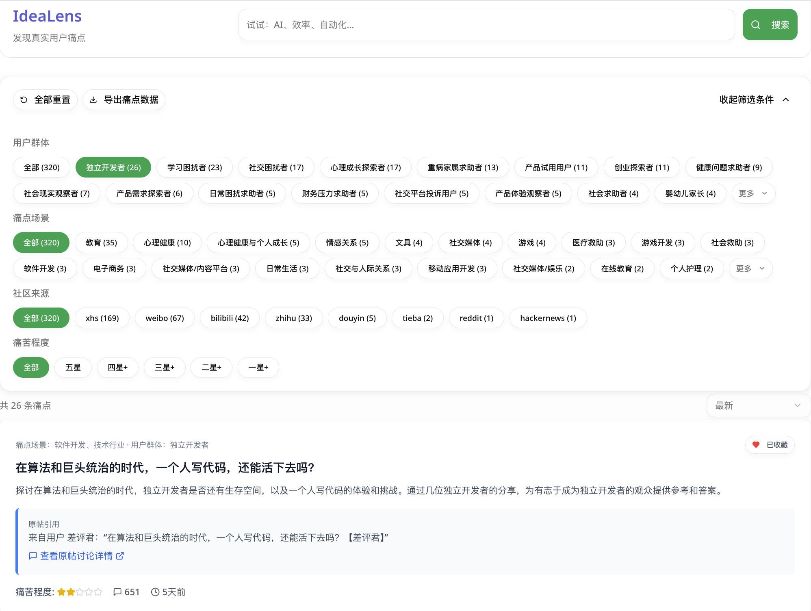

# 🚀 Awesome One Person Company /一人公司精选清单

<div align="center">


<p align="center">
  <a href="https://awesome.re"></a>
  <a href="https://github.com/chen103226/awesome-one-person-company"></a>
  <a href="https://twitter.com/minghuachen22"></a>
  <a href="README.md"></a>
  <a href="README_EN.md"></a>
</p>

> 一个面向**一人公司 / 独立创业者 / 独立开发者**的高信号清单：只收录「**真实产品、真实收入（或可验证指标）、真实复盘**」，并尽量给出来源与一句话结论。
> 目标：让你用最少的时间，看到最值得学习的路径、坑与机会。

[🎯 快速开始](#-快速开始)  |  [💡 成功案例](#-成功案例)  |  [🛠️ 工具栈](#️-工具与技术栈)  |  [📚 学习资源](#-书籍与课程)  |  [👥 加入社区](#-社区与交流)

</div>

---

## 📖 目录

- [什么是一人公司？](#-什么是一人公司)
- [为什么要做这个清单？](#-为什么要做这个清单)
- [快速开始](#-快速开始)
- [🌟 明星创业者](#-明星创业者)
- [💰 成功案例分析](#-成功案例分析)
  - [国际案例](#国际案例-100k-arr)
  - [中国案例](#中国案例)
  - [失败案例与复盘](#失败案例与复盘)
- [💡 创业Idea池](#-创业idea池)
- [🛠️ 工具与技术栈](#️-工具与技术栈)
- [📚 书籍与课程](#-书籍与课程)
- [📝 博客与通讯](#-博客与通讯)
- [👥 社区与交流](#-社区与交流)
- [🧠 方法论与心智模型](#-方法论与心智模型)
- [🇨🇳 中文资源](#-中文资源)
- [🤝 贡献指南](#-贡献指南)
- [📜 许可证](#-许可证)

---

## 🎯 什么是一人公司？

> **One Person Company (OPC)** = 个人驱动 + 可持续收入 + 智能杠杆 + 生活方式优先

一人公司是一种商业模式，它具有以下特征：

| 特征                   | 说明                               | 反例                        |
| ---------------------- | ---------------------------------- | --------------------------- |
| 👤**单人运营**   | 由1人（或至多5人小团队）构建与维护 | ❌ 需要大规模团队的项目     |
| 💵**可持续收入** | 有稳定的现金流（MRR/ARR）          | ❌ 纯粹的开源项目/hobby项目 |
| 🤖**杠杆效应**   | 依赖软件/内容/自动化，而非人力堆砌 | ❌ 咨询公司/劳动密集型服务  |
| 🎨**自主控制**   | 追求自由与自主，而非盲目扩张       | ❌ 风投驱动的高速增长公司   |

**💡 核心理念：** Build a life, not just a company. (构建生活方式，而非只是公司)

---

## 🚀 为什么要做这个清单?

市面上已有许多创业资源，但**一人公司**这个细分领域的**中文优质内容稀缺**：

- ❌ 大部分创业内容聚焦风投/融资路线
- ❌ 技术教程与商业实战脱节
- ❌ 成功案例多为国外，缺少中国本土案例
- ✅ **本清单专注于**：可复制的小而美商业模式 + 真实财务数据 + 中西结合

---

## 🏃 快速开始

### 📋 30天一人公司启动清单

**Week 1: 验证想法 💡**

- [ ] 确定目标用户痛点（至少访谈10人）
- [ ] 在Reddit/X/小红书寻找相关抱怨
- [ ] 制作简单的落地页（Carrd/Framer）
- [ ] 预售测试（至少5个意向付费用户）

**🎓** 推荐学习： [《The Mom Test》](https://www.momtestbook.com/)（2小时读完）

**Week 2: MVP开发 🛠️**

- [ ] 选择技术栈（推荐：Next.js + Supabase + Vercel）
- [ ] 开发核心功能（只做最小可行产品）
- [ ] 集成支付（Stripe/Lemon Squeezy）
- [ ] 设置分析工具（Plausible/PostHog）

**💰** 预算参考： $0-100（使用免费额度）

**Week 3: 内测与迭代 🔄**

- [ ] 邀请10-20个beta用户
- [ ] 收集反馈并快速迭代
- [ ] 准备Product Hunt发布素材

**📊** 目标指标： Beta 用户留存率 > 30%

**Week 4: 公开发布 🚀**

- [ ] Product Hunt发布
- [ ] 在相关社区分享（Reddit/Hacker News/V2EX）
- [ ] 撰写"Build in Public"博客
- [ ] 设置客服渠道

**🎯** 目标： 获得第一个付费用户

### 🎓 推荐学习路径

1. **完全新手** → [FreeCodeCamp](https://www.freecodecamp.org/) + [《The Lean Startup》](#书籍)
2. **有技术基础** → [Indie Hackers访谈](https://www.indiehackers.com/interviews) + 本清单工具栈
3. **有产品但没收入** → [《The Mom Test》](#书籍) + [增长黑客工具](#营销工具)

---

## 🌟 明星创业者

> 这些创业者通过一人公司模式实现了**财务自由+生活方式自由**

### 国际明星 🌍

#### 💎 Pieter Levels - 传奇数字游民

- **产品**: [Nomad List](https://nomadlist.com/) | [Remote OK](https://remoteok.com/) | [Photo AI](https://photoai.com/)
- **收入**: $2.1M+/年 (2024)
- **特点**: 12个月创办12家公司 | 70+项目，4个盈利 | Build in Public先驱
- **技术栈**: PHP, jQuery, SQLite（极简主义）
- **社交**: [@levelsio](https://twitter.com/levelsio)
- **学习资源**: [Lex Fridman访谈](https://www.youtube.com/watch?v=oFtjKbXKqbg)

#### 🎨 Marc Lou - AI独立开发者天花板

- **产品**: [ShipFast](https://shipfa.st/) | 25个项目启动，12个盈利
- **收入**: $1.03M/年 (2025)
- **特点**: 多产品矩阵策略 | SaaS boilerplate爆款
- **技术栈**: Next.js, Tailwind, Supabase
- **社交**: [@marc_louvion](https://twitter.com/marc_louvion)

#### 📊 Jon Yongfook - B2B SaaS专家

- **产品**: [Bannerbear](https://www.bannerbear.com/)
- **收入**: $600K+ ARR
- **特点**: API-first产品 | 自动化图像生成
- **技术栈**: Ruby on Rails, AWS

#### ✍️ Daniel Vassallo - 小赌注哲学

- **产品**: [Small Bets](https://smallbets.co/) 社区
- **特点**: 前AWS工程师 | "多样化收入流"理论创始人
- **社交**: [@dvassallo](https://twitter.com/dvassallo)

### 中国创业者 🇨🇳

#### TODO

- **产品**:
- **收入**:
- **特点**:
- **平台**:

---

## 💰 成功案例分析

> 每个案例包含：收入数据 | 用户量 | 技术栈 | 启动成本 | 关键转折点

### 国际案例 ($100K+ ARR)

<details>
<summary><b>📊 案例1: Nomad List by Pieter Levels</b> - $2.1M/年</summary>

**产品概述**
帮助数字游民找到全球最适合远程工作的城市

**关键数据**

- 💰 **年收入**: $2.1M (2024)
- 👥 **会员**: 10,000+ 付费会员 ($119/终身)
- 📈 **流量**: 500K+ 月访问量
- ⏱️ **启动**: 2014年（10年运营）
- 💵 **初始成本**: ~$0 (自学编程)

**技术栈**

```
Frontend: HTML, jQuery
Backend: PHP, Vanilla JS
Database: SQLite
Hosting: DigitalOcean VPS
Payment: Stripe
Analytics: 自建（PHP脚本）
```

**商业模式**

- 会员订阅: $119 终身会员（早期）→ $99/年（现在）
- 远程工作招聘板: Remote OK（$299/职位）
- 联盟营销（酒店、保险）

**关键转折点**

1. 2014年在Hacker News首页 → 首批1000用户
2. 2015年加入Nomad Cost功能 → 差异化优势
3. 2017年推出Remote OK → 收入翻倍
4. 2020年疫情 → 远程工作爆发，流量x3

**可复制要素**
✅ Build in Public（公开收入数据）
✅ 解决自己的痛点（Pieter本身是数字游民）
✅ 社区驱动（用户贡献城市数据）
✅ 极简技术栈（降低维护成本）

**学习资源**

- [Nomad List公开收入页](https://nomadlist.com/open)
- [Pieter的X账号](https://twitter.com/levelsio)
- [Indie Hackers访谈](https://www.indiehackers.com/podcast/043-pieter-levels-of-nomad-list)

</details>

<details>
<summary><b>📊 案例2: Bannerbear by Jon Yongfook</b> - $600K ARR</summary>

**产品概述**
自动化图像/视频生成API，用于批量生成社交媒体图像

**关键数据**

- 💰 **年收入**: $600K ARR
- 👥 **客户**: 5,000+ 企业用户
- 📈 **增长率**: 50% YoY
- ⏱️ **启动**: 2019年
- 💵 **初始成本**: ~$5K (AWS infra)

**技术栈**

```
Frontend: Vue.js, Tailwind
Backend: Ruby on Rails
Database: PostgreSQL
Image Processing: ImageMagick, Chromium
Hosting: AWS (EC2, S3, Lambda)
Payment: Stripe
Queue: Sidekiq
```

**商业模式**

- SaaS订阅: $49-$499/月（基于API调用量）
- 企业定制方案: $1K+/月

**关键转折点**

1. 2019年Product Hunt #1 → 首批100付费用户
2. 2020年加入Zapier集成 → MRR翻倍
3. 2021年发布视频API → 进入新市场
4. 2022年专注B2B → 客单价x3

**可复制要素**
✅ API-first产品（易集成）
✅ 瞄准B2B市场（高客单价）
✅ Freemium模式（降低试用门槛）
✅ 专注单一功能（避免feature creep）

**学习资源**

- [Jon的博客](https://yongfook.com/)
- [Bannerbear案例研究](https://www.indiehackers.com/product/bannerbear)

</details>

<details>
<summary><b>📊 案例3: ConvertKit by Nathan Barry</b> - $29M ARR</summary>

**产品概述**
面向创作者的邮件营销工具（已扩展至小团队）

**关键数据**

- 💰 **年收入**: $29M ARR (2024)
- 👥 **用户**: 500K+ 创作者
- 📈 **团队**: 从1人→70人（仍保持精益）
- ⏱️ **启动**: 2013年
- 💵 **初始成本**: $5K 外包开发

**技术栈**

```
Frontend: React, Tailwind
Backend: Ruby on Rails
Database: PostgreSQL, Redis
Hosting: AWS
Email: 自研SMTP引擎
Payment: Stripe
```

**商业模式**

- SaaS订阅: $9-$79/月（基于订阅者数量）
- Creator Network（联盟推广）

**关键转折点**

1. 2013年手动邀请前100个博主 → Product-Market Fit
2. 2015年品牌重塑 → 从"email tool"到"creator platform"
3. 2017年推出免费计划 → 用户增长10x
4. 2021年收购SparkLoop → 进入增长工具市场

**可复制要素**
✅ 专注细分市场（创作者 vs 通用邮件工具）
✅ Do things that don't scale（手动邀请早期用户）
✅ 内容营销（Nathan的个人品牌）
✅ Freemium转化漏斗

**特别提示**: Nathan从一人公司逐步扩展到团队，但保持了bootstrapping精神（无融资）

**学习资源**

- [Nathan Barry博客](https://nathanbarry.com/)
- [Authority书籍](https://nathanbarry.com/authority/)

</details>

### 中国案例

<details>
<summary><b>🇨🇳 案例1: 小熊猫C++ IDE</b> - 月入5万+</summary>

**产品概述**
免费的Windows下的C/C++集成开发环境

**关键数据**

- 💰 **收入**: 月入5万+ RMB
- 👥 **用户**: 100万+ 下载量
- 📈 **模式**: 免费产品+赞助+咨询
- ⏱️ **启动**: 2020年
- 💵 **初始成本**: ¥0（个人项目）

**技术栈**

```
语言: C++, Qt
Compiler: MinGW-w64
Editor: Scintilla
Platform: Windows
分发: GitHub Releases
```

**商业模式**

- 软件免费
- 爱发电平台赞助: ¥2-30万/月
- 技术咨询: ¥3K-1万/次
- 教学合作: 高校/培训机构

**关键转折点**

1. 2020年在V2EX发布 → 首批1000用户
2. 2021年B站教程视频爆火 → 学生用户激增
3. 2022年加入爱发电 → 收入稳定
4. 2023年高校合作 → 打开B端市场

**可复制要素**
✅ 教育市场切入（学生用户粘性高）
✅ 开源+赞助模式（中国特色）
✅ 视频内容营销（B站/抖音）
✅ 大学老师背景（增加可信度）

**学习资源**

- [小熊猫C++ GitHub](https://github.com/royqh1979/RedPanda-CPP)
- [B站教程](搜索)

</details>

### 失败案例与复盘

> 💡 失败比成功更有学习价值！

**学习资源**

- [Failory](https://www.failory.com/) - 90%的创业公司失败，学习如何避免失败。每周分享创业失败案例和成功故事，帮助创始人从失败中学习。

## 💡 创业Idea池

> 🎲 发现真实用户痛点，找到值得解决的创业机会

**工具推荐**

- [IdeaLens](https://muselearner.com/) - 发现真实用户痛点，在构建之前了解用户真正需要什么。IdeaLens 监听真实讨论，提取痛点，标记用户画像和场景，并按紧急程度排序，帮助你构建用户真正需要的产品。
  

使用**The Mom Test**原则：

```
1. 确定目标用户（越具体越好）
   ❌ "想帮助创业者"  
   ✅ "帮助B站up主分析视频数据"

2. 发现真实痛点（避免假需求）
   ❌ "你觉得这个功能有用吗？"  
   ✅ "上次你分析数据时遇到什么困难？"

3. 验证付费意愿（提前收钱）
   ❌ "如果我做了你会用吗？"  
   ✅ "如果现在就有，你愿意支付多少？"

4. 快速MVP测试（1-2周）
   - 制作落地页 + Waitlist
   - 手动提供服务（伪装自动化）
   - 至少5个付费意向用户 → 开始开发
```

### 🎯 从Idea到首个付费用户的30天路线图

见 [快速开始](#-快速开始) 章节

---

## 🛠️ 工具与技术栈

> ⚡ 一人公司的核心武器：用工具替代团队

### 🏗️ 建站与设计

#### 落地页/官网

| 工具                             | 适用场景       | 定价      | 推荐指数   | 学习曲线 |
| -------------------------------- | -------------- | --------- | ---------- | -------- |
| [Framer](https://www.framer.com/)   | 高质量营销网站 | $5-15/月  | ⭐⭐⭐⭐⭐ | 低       |
| [Webflow](https://webflow.com/)     | 复杂交互网站   | $14-39/月 | ⭐⭐⭐⭐   | 中       |
| [Carrd](https://carrd.co/)          | 超简单单页     | $9-49/年  | ⭐⭐⭐⭐   | 极低     |
| [Super](https://super.so/) + Notion | Notion → 网站 | $12/月    | ⭐⭐⭐⭐   | 极低     |

**💡 Pieter Levels推荐**: 直接手写HTML + Tailwind CSS（最大控制权）

#### UI设计

| 工具                               | 用途       | 免费版      | 推荐场景   |
| ---------------------------------- | ---------- | ----------- | ---------- |
| [Figma](https://www.figma.com/)       | UI/UX设计  | ✅ 3个项目  | 所有场景   |
| [Canva](https://www.canva.com/)       | 营销素材   | ✅ 有限模板 | 非设计师   |
| [Excalidraw](https://excalidraw.com/) | 手绘风图表 | ✅ 完全免费 | 技术架构图 |
| [Unsplash](https://unsplash.com/)     | 高质量图片 | ✅ 完全免费 | 所有场景   |

### 💻 开发技术栈

#### 🔥 推荐组合（2026年主流）

**全栈方案A: Vercel生态**

```bash
Frontend: Next.js 14 (App Router) + React 18
UI: Tailwind CSS + shadcn/ui
Backend: Next.js API Routes
Database: Supabase (PostgreSQL)
Auth: Supabase Auth
Storage: Supabase Storage
Hosting: Vercel
Domain: Namecheap
```

**优点**: 开发速度快 | 部署自动化 | 生态完善
**适合**: SaaS产品 | AI应用 | 内容平台

**全栈方案B: Laravel生态（PHP）**

```bash
Framework: Laravel 11
Frontend: Inertia.js + Vue 3 / Livewire
UI: Tailwind CSS
Database: MySQL / PostgreSQL
Cache: Redis
Queue: Laravel Queue
Hosting: Hetzner / DigitalOcean
```

**优点**: 成本低 | 文档完善 | 社区庞大
**适合**: 内容平台 | 会员网站 | 企业应用

**极简方案: Pieter Levels风格**

```bash
Frontend: Vanilla JS / jQuery
Backend: PHP (原生)
Database: SQLite
Hosting: DigitalOcean VPS
Template: PHP模板
```

**优点**: 零依赖 | 超低成本 | 完全控制
**适合**: MVP | 简单CRUD | 个人项目

#### 数据库与后端

| 服务                                 | 类型               | 免费额度   | 推荐场景     |
| ------------------------------------ | ------------------ | ---------- | ------------ |
| [Supabase](https://supabase.com/)       | PostgreSQL BaaS    | 500MB      | 全栈应用     |
| [PlanetScale](https://planetscale.com/) | MySQL (Serverless) | 1个DB      | 高并发应用   |
| [Upstash](https://upstash.com/)         | Redis / Kafka      | 10K命令/天 | 缓存 / Queue |
| [Turso](https://turso.tech/)            | SQLite (分布式)    | 500MB      | Edge应用     |

### 💳 支付与订阅

| 平台                                    | 费率         | 优点     | 缺点       | 适合地区  |
| --------------------------------------- | ------------ | -------- | ---------- | --------- |
| [Stripe](https://stripe.com/)              | 2.9% + $0.30 | 功能强大 | 中国支持差 | 🌍 国际   |
| [Lemon Squeezy](https://lemonsqueezy.com/) | 5% + 交易费  | 一站式   | 费率略高   | 🌍 国际   |
| [Paddle](https://paddle.com/)              | 5% + $0.50   | 合规友好 | 审批慢     | 🇪🇺 欧美 |
| [微信支付](https://pay.weixin.qq.com/)     | 0.6%         | 中国首选 | 仅中国     | 🇨🇳 中国 |
| [支付宝](https://b.alipay.com/)            | 0.6%         | 中国首选 | 仅中国     | 🇨🇳 中国 |

**💡 独立开发者首选**: Stripe（国际） + Lemon Squeezy（数字商品）

### 📊 数据分析

| 工具                                             | 类型         | 定价         | 特点     |
| ------------------------------------------------ | ------------ | ------------ | -------- |
| [Plausible](https://plausible.io/)                  | 隐私友好分析 | $9-69/月     | 简单     |
| [PostHog](https://posthog.com/)                     | 产品分析     | 免费-$450/月 | 功能完整 |
| [Umami](https://umami.is/)                          | 开源分析     | 自托管免费   | 极简     |
| [Google Analytics 4](https://analytics.google.com/) | 传统分析     | 免费         | 功能强   |

**💡 推荐**: Plausible（付费） 或 Umami（自托管）

### 📧 邮件营销

| 平台                                   | 免费额度  | 特色功能     | 适合场景   |
| -------------------------------------- | --------- | ------------ | ---------- |
| [ConvertKit](https://convertkit.com/)     | 1K订阅者  | 创作者友好   | Newsletter |
| [Buttondown](https://buttondown.email/)   | 100订阅者 | Markdown写作 | 技术博客   |
| [MailerLite](https://www.mailerlite.com/) | 1K订阅者  | 自动化       | 电商/SaaS  |
| [Resend](https://resend.com/)             | 3K邮件/月 | 开发者友好   | 交易邮件   |

### 🤖 自动化与集成

| 工具                       | 类型         | 免费版     | 推荐场景   |
| -------------------------- | ------------ | ---------- | ---------- |
| [Zapier](https://zapier.com/) | 可视化自动化 | 5个Zaps    | 非技术用户 |
| [Make](https://make.com/)     | 可视化自动化 | 1K操作/月  | 复杂流程   |
| [n8n](https://n8n.io/)        | 开源自动化   | 自托管免费 | 技术用户   |

### 🎨 AI工具箱

| 工具                               | 功能       | 定价       | 推荐指数   |
| ---------------------------------- | ---------- | ---------- | ---------- |
| [ChatGPT](https://chat.openai.com/)   | 通用AI助手 | $0-20/月   | ⭐⭐⭐⭐⭐ |
| [Claude](https://claude.ai/)          | 长文本处理 | $0-20/月   | ⭐⭐⭐⭐⭐ |
| [Cursor](https://cursor.sh/)          | AI编程     | $20/月     | ⭐⭐⭐⭐⭐ |
| [v0.dev](https://v0.dev/)             | AI生成UI   | Vercel积分 | ⭐⭐⭐⭐   |
| [Midjourney](https://midjourney.com/) | AI绘画     | $10-60/月  | ⭐⭐⭐⭐   |

### 📱 客服与沟通

| 工具                           | 类型     | 免费版      | 适合场景   |
| ------------------------------ | -------- | ----------- | ---------- |
| [Crisp](https://crisp.chat/)      | 在线客服 | 2席位       | 网站聊天   |
| [Intercom](https://intercom.com/) | 客户平台 | 付费        | 大规模SaaS |
| [Tawk.to](https://www.tawk.to/)   | 在线客服 | 完全免费    | 预算有限   |
| [Plain](https://plain.com/)       | 客服工单 | 免费-$29/月 | 技术支持   |

### 🚀 托管与部署

| 平台                                   | 适合类型     | 免费额度   | 优点      |
| -------------------------------------- | ------------ | ---------- | --------- |
| [Vercel](https://vercel.com/)             | Next.js/前端 | Hobby免费  | 部署极快  |
| [Netlify](https://netlify.com/)           | JAMstack     | 100GB/月   | CI/CD完善 |
| [Railway](https://railway.app/)           | 全栈应用     | $5试用     | 简单易用  |
| [Fly.io](https://fly.io/)                 | 容器应用     | 3个VM      | 全球边缘  |
| [Hetzner](https://hetzner.com/)           | VPS          | €4.5/月起 | 性价比高  |
| [DigitalOcean](https://digitalocean.com/) | VPS          | $6/月起    | 新手友好  |

**💡 成本优化建议**:

- MVP阶段: 全部用免费额度（Vercel + Supabase + Cloudflare）
- 有收入后: 升级到VPS（Hetzner €20/月可支撑10K用户）

### 🎯 推广与分发

| 渠道                                      | 成本 | 效果       | 适合产品        |
| ----------------------------------------- | ---- | ---------- | --------------- |
| [Product Hunt](https://producthunt.com/)     | 免费 | ⭐⭐⭐⭐   | 所有产品        |
| [Hacker News](https://news.ycombinator.com/) | 免费 | ⭐⭐⭐⭐⭐ | 技术产品        |
| [Reddit](https://reddit.com/)                | 免费 | ⭐⭐⭐⭐   | 细分领域        |
| [X (Twitter)](https://x.com/)                | 免费 | ⭐⭐⭐⭐⭐ | Build in Public |
| [即刻](https://okjike.com/)                  | 免费 | ⭐⭐⭐     | 中文社区        |
| [V2EX](https://v2ex.com/)                    | 免费 | ⭐⭐⭐⭐   | 技术产品        |
| [小红书](https://xiaohongshu.com/)           | 免费 | ⭐⭐⭐⭐   | 消费品/工具     |

---

## 📚 书籍与课程

> 📖 一人公司必读书单（按推荐优先级排序）

### 🔥 必读经典

| 书名                                  | 作者            | 适合阶段    | 核心价值          | 购买链接                                   |
| ------------------------------------- | --------------- | ----------- | ----------------- | ------------------------------------------ |
| **The Mom Test**                | Rob Fitzpatrick | 💡 想法验证 | 如何访谈用户      | [Amazon](https://momtestbook.com/)            |
| **Company of One**              | Paul Jarvis     | 🎯 理念建立 | 一人公司哲学      | [官网](https://ofone.co/)                     |
| **The Minimalist Entrepreneur** | Sahil Lavingia  | 🚀 启动期   | Gumroad创始人经验 | [官网](https://sahillavingia.com/book)        |
| **The Lean Startup**            | Eric Ries       | 🚀 启动期   | MVP与迭代         | [Amazon](https://theleanstartup.com/)         |
| **Zero to One**                 | Peter Thiel     | 🧠 战略思维 | 从0到1的创新      | [Amazon](https://amazon.com/)                 |
| **Rework**                      | Basecamp        | 🧠 反常识   | 挑战传统商业观念  | [Basecamp](https://basecamp.com/books/rework) |
| **The Personal MBA**            | Josh Kaufman    | 📚 商业基础 | 商业知识速成      | [官网](https://personalmba.com/)              |

### 🇨🇳 中文书籍

| 书名           | 作者                  | 推荐理由     |
| -------------- | --------------------- | ------------ |
| 《一人公司》   | Paul Jarvis（中译本） | 入门必读     |
| 《重来》系列   | Basecamp（中译本）    | 反主流商业观 |
| 《精益创业》   | Eric Ries（中译本）   | MVP方法论    |
| 《黑客与画家》 | Paul Graham（中译本） | 创业思维启蒙 |

### 🎓 在线课程

| 课程                                                     | 平台 | 定价   | 推荐指数        |
| -------------------------------------------------------- | ---- | ------ | --------------- |
| [30x500 Academy](https://30x500.com/)                       | 付费 | $1,970 | ⭐⭐⭐⭐⭐      |
| [Indie Hackers学习中心](https://www.indiehackers.com/start) | 免费 | $0     | ⭐⭐⭐⭐        |
| [Y Combinator Startup School](https://startupschool.org/)   | 免费 | $0     | ⭐⭐⭐⭐⭐      |
| [FreeCodeCamp](https://freecodecamp.org/)                   | 免费 | $0     | ⭐⭐⭐⭐ (技术) |

---

## 📝 博客与通讯

> 📬 持续学习的最佳来源

### 国际博客

| 博主                      | 主题             | 更新频率 | 订阅链接                                       |
| ------------------------- | ---------------- | -------- | ---------------------------------------------- |
| **Levels.io**       | Build in Public  | 周更     | [Blog](https://levels.io/)                        |
| **Arvid Kahl**      | Bootstrapped创业 | 周更     | [Newsletter](https://thebootstrappedfounder.com/) |
| **Daniel Vassallo** | 小赌注策略       | 月更     | [X账号](https://twitter.com/dvassallo)            |
| **Justin Jackson**  | SaaS创业         | 周更     | [Blog](https://justinjackson.ca/)                 |
| **Nathan Barry**    | 创作者经济       | 周更     | [Blog](https://nathanbarry.com/)                  |
| **Ben Thompson**    | 科技商业分析     | 周3更    | [Stratechery](https://stratechery.com/)           |

### 中文博客

| 博主                 | 平台                              | 主题          | 推荐理由       |
| -------------------- | --------------------------------- | ------------- | -------------- |
| **阮一峰**     | [博客](https://ruanyifeng.com/blog/) | 技术+创业     | 科技爱好者周刊 |
| **Moonvy月维** | [即刻](https://okjike.com/u/moonvy)  | 设计+独立开发 | 设计师视角     |
| **Peng Jie**   | [Blog](https://pengjie.dev/)         | 独立开发      | 技术实战       |

### 🔔 Newsletter推荐

| 名称                     | 语言 | 频率   | 主题        | 订阅链接                               |
| ------------------------ | ---- | ------ | ----------- | -------------------------------------- |
| Indie Hackers Newsletter | 🇺🇸 | 周     | 案例访谈    | [订阅](https://indiehackers.com/)         |
| Small Bets               | 🇺🇸 | 周     | 多元化收入  | [订阅](https://smallbets.co/)             |
| Tiny Empires             | 🇺🇸 | 周     | Gumroad创业 | [订阅](https://tinyempires.substack.com/) |
| 湾区日报                 | 🇨🇳 | 工作日 | 技术创业    | [订阅](https://wanqu.co/)                 |

---

## 👥 社区与交流

> 🤝 找到你的同路人

### 国际社区

| 社区                                             | 规模  | 氛围        | 加入链接                               |
| ------------------------------------------------ | ----- | ----------- | -------------------------------------- |
| [Indie Hackers](https://indiehackers.com/)          | 100K+ | 🔥 非常活跃 | [Join](https://indiehackers.com/)         |
| [WIP](https://wip.co/)                              | 5K+   | 💼 专业     | [Join](https://wip.co/)                   |
| [Indie Worldwide](https://indieworldwide.com/)      | 10K+  | 🌍 全球化   | [Join](https://indieworldwide.com/)       |
| [MicroConf Connect](https://microconfconnect.com/)  | 8K+   | 🎯 SaaS聚焦 | [Join](https://microconfconnect.com/)     |
| [r/SideProject](https://reddit.com/r/SideProject)   | 200K+ | 📢 发布友好 | [Join](https://reddit.com/r/SideProject)  |
| [r/Entrepreneur](https://reddit.com/r/Entrepreneur) | 3M+   | 🚀 综合创业 | [Join](https://reddit.com/r/Entrepreneur) |

### 中文社区

| 社区                           | 平台    | 人群              | 特点       | 加入链接                         |
| ------------------------------ | ------- | ----------------- | ---------- | -------------------------------- |
| **电鸭社区**             | Web     | 远程工作/独立开发 | 职位+交流  | [eleduck.com](https://eleduck.com/) |
| **INDEV独立开发者社区**  | Web     | 独立开发者        | 产品展示   | [indev.cn](https://indev.cn/)       |
| **即刻·独立开发者圈子** | App     | 创作者            | 轻松氛围   | [App内搜索]                      |
| **V2EX**                 | Web     | 技术人            | 技术为主   | [v2ex.com](https://v2ex.com/)       |
| **少数派**               | Web/App | 效率工具爱好者    | 高质量内容 | [sspai.com](https://sspai.com/)     |

### 🏆 线下活动

| 活动                   | 地点            | 频率   | 官网                                           |
| ---------------------- | --------------- | ------ | ---------------------------------------------- |
| MicroConf              | 🇺🇸 拉斯维加斯 | 年度   | [microconf.com](https://microconf.com/)           |
| Indie Worldwide Meetup | 🌍 全球各地     | 月度   | [indieworldwide.com](https://indieworldwide.com/) |
| 独立开发者大会         | 🇨🇳 北京/上海  | 不定期 | 关注即刻圈子                                   |

---

## 🧠 方法论与心智模型

> 💡 改变认知的关键文章

### 必读文章

| 标题                                    | 作者            | 核心观点             | 链接                                            |
| --------------------------------------- | --------------- | -------------------- | ----------------------------------------------- |
| **Do Things That Don't Scale**    | Paul Graham     | 早期要做不可扩展的事 | [阅读](http://paulgraham.com/ds.html)              |
| **Startup = Growth**              | Paul Graham     | 创业本质是增长       | [阅读](http://paulgraham.com/growth.html)          |
| **Default Alive or Default Dead** | Paul Graham     | 现金流生死线         | [阅读](http://paulgraham.com/aord.html)            |
| **1,000 True Fans**               | Kevin Kelly     | 千名铁杆粉丝理论     | [阅读](https://kk.org/thetechnium/1000-true-fans/) |
| **Tiny Bets**                     | Daniel Vassallo | 小赌注策略           | [阅读](https://dvassallo.gumroad.com/)             |
| **Build Once, Sell Many**         | Nathan Barry    | 产品化思维           | [阅读](https://nathanbarry.com/)                   |

### 关键概念

<details>
<summary><b>💰 商业模式选择</b></summary>

**一人公司最适合的6种商业模式：**

1. **微型SaaS** ($1K-100K ARR)

   - 例子: Plausible ($1M ARR, 3人团队)
   - 优点: 可预测收入 | 自动化程度高
   - 难点: 需要持续营销 | 客户流失
2. **付费通讯** ($5K-500K ARR)

   - 例子: Stratechery ($3M ARR, 1人)
   - 优点: 低成本 | 直接关系
   - 难点: 需要持续输出 | 打造个人品牌
3. **数字产品** ($10K-1M ARR)

   - 例子: Gumroad上的课程/模板
   - 优点: 一次创作多次销售
   - 难点: 需要营销 | 盗版风险
4. **API服务** ($10K-1M ARR)

   - 例子: Bannerbear ($600K ARR)
   - 优点: B2B高客单价 | 易集成
   - 难点: 技术门槛高
5. **开源+赞助** ($5K-100K ARR)

   - 例子: 小熊猫C++ (月入5万)
   - 优点: 中国特色 | 社区支持
   - 难点: 收入不稳定
6. **咨询+产品化** ($50K-500K ARR)

   - 例子: 专业领域顾问
   - 优点: 快速变现 | 高利润率
   - 难点: 时间换钱 | 难扩展

<details>
<summary><b>📈 增长策略</b></summary>

**AARRR海盗指标：**

1. **Acquisition (获客)**

   - SEO: 长期投资
   - 内容营销: Build in Public
   - 社区: Reddit, HN, PH
   - 付费广告: Google Ads (谨慎)
2. **Activation (激活)**

   - Aha时刻: 用户首次体验核心价值
   - Onboarding: 减少到1分钟内
   - 引导视频/教程
3. **Retention (留存)**

   - 邮件营销: 流失挽回
   - 产品迭代: 用户反馈驱动
   - 社区建设
4. **Revenue (变现)**

   - Freemium转化漏斗
   - 升级提示
   - 使用限额
5. **Referral (推荐)**

   - 推荐奖励计划
   - 社交分享按钮
   - 品牌水印

</details>

---

## 🇨🇳 中文资源

> 🐉 专注中国市场的一人公司资源

### 🎤 中文播客

| 播客名称           | 主持人 | 主题           | 收听平台                             |
| ------------------ | ------ | -------------- | ------------------------------------ |
| **津津乐道** | 朱峰等 | 科技创业       | [小宇宙](https://www.xiaoyuzhoufm.com/) |
| **无人知晓** | Zine   | 独立开发者     | [小宇宙](https://www.xiaoyuzhoufm.com/) |
| **代码之外** | 余晟等 | 技术人职业发展 | [小宇宙](https://www.xiaoyuzhoufm.com/) |

### 📺 视频创作者

| 创作者               | 平台        | 内容类型  | 推荐度     |
| -------------------- | ----------- | --------- | ---------- |
| **李自然说**   | B站/YouTube | 独立开发  | ⭐⭐⭐⭐⭐ |
| **程序员鱼皮** | B站         | 编程+创业 | ⭐⭐⭐⭐   |
| **代码真香**   | B站         | 技术教程  | ⭐⭐⭐⭐   |

### 🏙️ 中国本土案例

| 产品       | 创建者                          | 收入     | 特点         |
| ---------- | ------------------------------- | -------- | ------------ |
| 小报童     | [@lixian](https://t.me/xiaobao_xb) | 未公开   | 付费专栏平台 |
| Cubox      | [@cubox](https://cubox.pro/)       | 未公开   | 稍后阅读     |
| Rime输入法 | 佛振                            | 开源赞助 | 开源典范     |

### 🇨🇳 中国特色策略

**支付方式：**

- 必须接入微信支付+支付宝
- 考虑爱发电/知识星球（赞助模式）

**分发渠道：**

- 小红书: 种草营销
- 抖音: 短视频引流
- 知乎: 专业内容
- V2EX: 技术社区

**合规要点：**

- ICP备案（网站必须）
- 软著申请（App推荐）
- 支付资质（个人企业化）

---

## 🤝 贡献指南

> 💚 欢迎所有形式的贡献！

### 如何贡献？

我们接受以下类型的贡献：

- ✅ 添加新的案例、工具、资源
- ✅ 修正错误信息或失效链接
- ✅ 改进文档结构和表达
- ✅ 翻译内容（中英互译）
- ✅ 分享你的一人公司故事

### 贡献流程

1. **Fork本仓库**
2. **创建新分支**: `git checkout -b add-new-resource`
3. **提交修改**: `git commit -m "Add: [资源名称]"`
4. **推送分支**: `git push origin add-new-resource`
5. **提交Pull Request**

### 内容质量标准

**✅ 好的贡献：**

- 包含真实可验证的数据（收入、用户量等）
- 提供官方链接或可信来源
- 说明推荐理由
- 格式规范、分类准确

**❌ 不接受：**

- 纯广告性质的推广
- 未验证的数据或谣言
- 与"一人公司"主题无关的内容
- 付费推广（除非明确标注）

### 案例提交模板

```markdown
#### [产品名称]
- **创建者**: [名字] - [社交链接]
- **产品**: [简短描述]
- **收入**: $XXK ARR / 月入XX万
- **技术栈**: [主要技术]
- **特点**: [核心亮点]
- **学习资源**: [采访/博客链接]
```

---

## 📬 订阅更新

想及时收到新案例和工具推荐？

- 🌟 **Star本仓库**: 在GitHub获得更新通知
- 🐦 **X/Twitter**: [@yourhandle](https://twitter.com/minghuachen22)
- 💬 **微信群**: 扫描下方二维码加入

<div align="center">


_*群满100人后请添加个人微信，备注"一人公司"*_

**⭐ Star 历史**


</div>

---

## 📜 许可证

本清单采用 [CC BY 4.0](https://creativecommons.org/licenses/by/4.0/) 许可协议。

这意味着你可以：

- ✅ 自由分享、复制、发行本清单
- ✅ 修改和演绎本清单
- ✅ 商业使用（需署名）

唯一要求：**署名原作者**

---

## 🙏 致谢

感谢以下资源的启发：

- [Awesome](https://github.com/sindresorhus/awesome) - Awesome清单鼻祖
- [Awesome Startup](https://github.com/KrishMunot/awesome-startup)
- [Indie Hackers](https://indiehackers.com/)
- 所有贡献者和一人公司践行者 ❤️

---

<div align="center">

**🚀 Start Your One Person Company Journey Today! 🚀**

Made with ❤️ by [M&amp;H](https://x.com/minghuachen22)

[⬆ 返回顶部](#-awesome-one-person-company)

</div>
